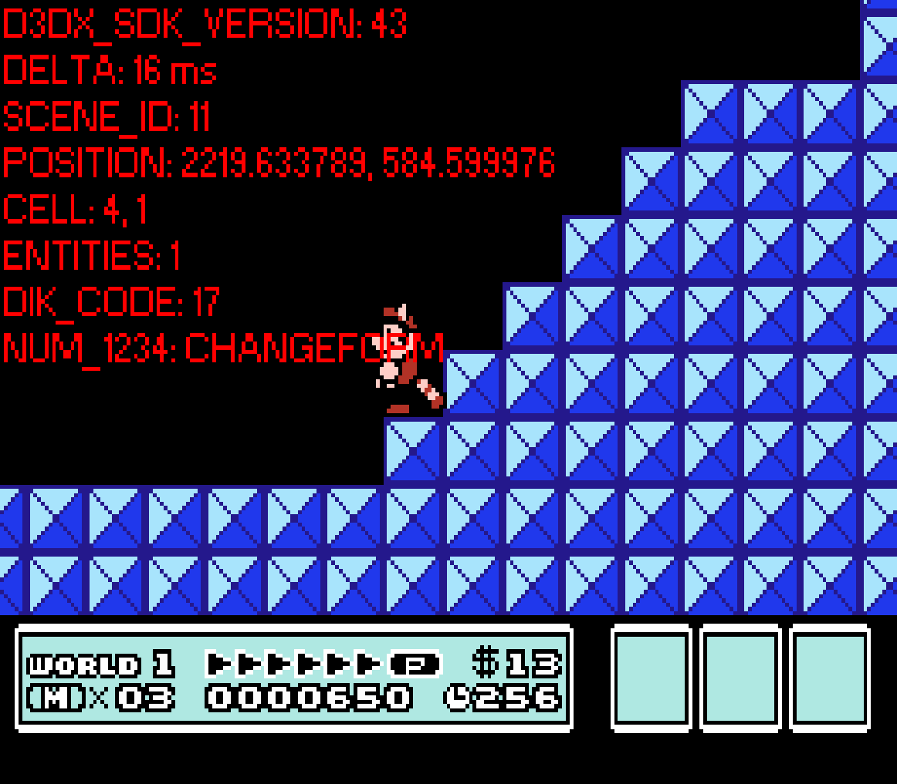

# Key binds

## Inputs


|Input |Symbol            |Default key    |Remappable? |
|------|------------------|---------------|------------|
|UP    |<kbd>⬆ </kbd>     |<kbd>W</kbd>   |Yes         |
|LEFT  |<kbd>⬅</kbd>     |<kbd>A</kbd>   |Yes         |
|DOWN  |<kbd>⬇ </kbd>     |<kbd>S</kbd>   |Yes         |
|RIGHT |<kbd>➡</kbd>     |<kbd>D</kbd>   |Yes         |
|SELECT|<kbd>SELECT</kbd> |<kbd>U</kbd>   |Yes         |
|START |<kbd>START</kbd>  |<kbd>I</kbd>   |Yes         |
|B     |<kbd>B</kbd>      |<kbd>J</kbd>   |Yes         |
|A     |<kbd>A</kbd>      |<kbd>K</kbd>   |Yes         |
|      |<kbd>Esc</kbd>    |<kbd>Esc</kbd> |No          |
|      |<kbd>Tab</kbd>    |<kbd>Tab</kbd> |No          |
|      |<kbd>1</kbd>      |<kbd>1</kbd>   |No          |
|      |<kbd>2</kbd>      |<kbd>2</kbd>   |No          |
|      |<kbd>3</kbd>      |<kbd>3</kbd>   |No          |
|      |<kbd>4</kbd>      |<kbd>4</kbd>   |No          |

## Rebinding
To rebind, open `key_binds.txt` in `SMB3_v2_C++\assets\data` directory and change the inputs to the supported keys below.\
E.g:
```
[UP]        [UP]
W       =>  NUMPAD0
[/]         [/]
```
Now input `UP` is bound to `0` on the numpad.\
Press `Tab` in game to check the current key being pressed.


## Supported keys list
For more information on the codes, [see here.](https://community.bistudio.com/wiki/DIK_KeyCodes)
|Group    |Name        |Key                   |Code             |
|---------|------------|----------------------|-----------------|
|Function |F1          |<kbd>F1</kbd>         |DIK_F1           |
|         |F2          |<kbd>F2</kbd>         |DIK_F2           |
|         |F3          |<kbd>F3</kbd>         |DIK_F3           |
|         |F4          |<kbd>F4</kbd>         |DIK_F4           |
|         |F5          |<kbd>F5</kbd>         |DIK_F5           |
|         |F6          |<kbd>F6</kbd>         |DIK_F6           |
|         |F7          |<kbd>F7</kbd>         |DIK_F7           |
|         |F8          |<kbd>F8</kbd>         |DIK_F8           |
|         |F9          |<kbd>F9</kbd>         |DIK_F9           |
|         |F10         |<kbd>F10</kbd>        |DIK_F10          |
|         |F11         |<kbd>F11</kbd>        |DIK_F11          |
|         |F12         |<kbd>F12</kbd>        |DIK_F12          |
|         |F13         |<kbd>F13</kbd>        |DIK_F13          |
|         |F14         |<kbd>F14</kbd>        |DIK_F14          |
|         |F15         |<kbd>F15</kbd>        |DIK_F15          |
|Numeric  |0           |<kbd>0</kbd>          |DIK_0            |
|         |1           |<kbd>1</kbd>          |DIK_1            |
|         |2           |<kbd>2</kbd>          |DIK_2            |
|         |3           |<kbd>3</kbd>          |DIK_3            |
|         |4           |<kbd>4</kbd>          |DIK_4            |
|         |5           |<kbd>5</kbd>          |DIK_5            |
|         |6           |<kbd>6</kbd>          |DIK_6            |
|         |7           |<kbd>7</kbd>          |DIK_7            |
|         |8           |<kbd>8</kbd>          |DIK_8            |
|         |9           |<kbd>9</kbd>          |DIK_9            |
|Numpad   |NUMPAD0     |<kbd>0</kbd>          |DIK_NUMPAD0      |
|         |NUMPAD1     |<kbd>1</kbd>          |DIK_NUMPAD1      |
|         |NUMPAD2     |<kbd>2</kbd>          |DIK_NUMPAD2      |
|         |NUMPAD3     |<kbd>3</kbd>          |DIK_NUMPAD3      |
|         |NUMPAD4     |<kbd>4</kbd>          |DIK_NUMPAD4      |
|         |NUMPAD5     |<kbd>5</kbd>          |DIK_NUMPAD5      |
|         |NUMPAD6     |<kbd>6</kbd>          |DIK_NUMPAD6      |
|         |NUMPAD7     |<kbd>7</kbd>          |DIK_NUMPAD7      |
|         |NUMPAD8     |<kbd>8</kbd>          |DIK_NUMPAD8      |
|         |NUMPAD9     |<kbd>9</kbd>          |DIK_NUMPAD9      |
|         |NUMPADENTER |<kbd>Enter</kbd>      |DIK_NUMPADENTER  |
|         |NUMLOCK     |<kbd>NumLock</kbd>    |DIK_NUMLOCK      |
|         |NUMPADMUL   |<kbd>*</kbd>          |DIK_NUMPADSTAR   |
|         |NUMPADSUB   |<kbd>-</kbd>          |DIK_NUMPADMINUS  |
|         |NUMPADADD   |<kbd>+</kbd>          |DIK_NUMPADPLUS   |
|         |NUMPADDEC   |<kbd>.</kbd>          |DIK_NUMPADPERIOD |
|         |NUMPADEQ    |<kbd>=</kbd>          |DIK_NUMPADEQUALS |
|         |NUMPADDIV   |<kbd>/</kbd>          |DIK_NUMPADSLASH  |
|Alphabet |A           |<kbd>A</kbd>          |DIK_A            |
|         |B           |<kbd>B</kbd>          |DIK_B            |
|         |C           |<kbd>C</kbd>          |DIK_C            |
|         |D           |<kbd>D</kbd>          |DIK_D            |
|         |E           |<kbd>E</kbd>          |DIK_E            |
|         |F           |<kbd>F</kbd>          |DIK_F            |
|         |G           |<kbd>G</kbd>          |DIK_G            |
|         |H           |<kbd>H</kbd>          |DIK_H            |
|         |I           |<kbd>I</kbd>          |DIK_I            |
|         |J           |<kbd>J</kbd>          |DIK_J            |
|         |K           |<kbd>K</kbd>          |DIK_K            |
|         |L           |<kbd>L</kbd>          |DIK_L            |
|         |M           |<kbd>M</kbd>          |DIK_M            |
|         |N           |<kbd>N</kbd>          |DIK_N            |
|         |O           |<kbd>O</kbd>          |DIK_O            |
|         |P           |<kbd>P</kbd>          |DIK_P            |
|         |Q           |<kbd>Q</kbd>          |DIK_Q            |
|         |R           |<kbd>R</kbd>          |DIK_R            |
|         |S           |<kbd>S</kbd>          |DIK_S            |
|         |T           |<kbd>T</kbd>          |DIK_T            |
|         |U           |<kbd>U</kbd>          |DIK_U            |
|         |V           |<kbd>V</kbd>          |DIK_V            |
|         |W           |<kbd>W</kbd>          |DIK_W            |
|         |X           |<kbd>X</kbd>          |DIK_X            |
|         |Y           |<kbd>Y</kbd>          |DIK_Y            |
|         |Z           |<kbd>Z</kbd>          |DIK_Z            |
|Control  |ESC         |<kbd>Esc</kbd>        |DIK_ESCAPE       |
|         |TAB         |<kbd>Tab</kbd>        |DIK_TAB          |
|         |LSHIFT      |<kbd>Shift</kbd>      |DIK_LSHIFT       |
|         |RSHIFT      |<kbd>Shift</kbd>      |DIK_RSHIFT       |
|         |LCTRL       |<kbd>Ctrl</kbd>       |DIK_LCONTROL     |
|         |RCTRL       |<kbd>Ctrl</kbd>       |DIK_RCONTROL     |
|         |BACKSPACE   |<kbd>Backspace</kbd>  |DIK_BACKSPACE    |
|         |ENTER       |<kbd>Enter</kbd>      |DIK_RETURN       |
|         |LALT        |<kbd>Alt</kbd>        |DIK_LALT         |
|         |RALT        |<kbd>Alt</kbd>        |DIK_RALT         |
|         |SPACE       |<kbd>␣</kbd>          |DIK_SPACE        |
|         |CAPS        |<kbd>CapsLock</kbd>   |DIK_CAPSLOCK     |
|         |SCROLL      |<kbd>ScrollLock</kbd> |DIK_SCROLL       |
|Symbol   |SUB         |<kbd>-</kbd>          |DIK_MINUS        |
|         |EQ          |<kbd>=</kbd>          |DIK_EQUALS       |
|         |LBRACKET    |<kbd>[</kbd>          |DIK_LBRACKET     |
|         |RBRACKET    |<kbd>]</kbd>          |DIK_RBRACKET     |
|         |SEMICOL     |<kbd>;</kbd>          |DIK_SEMICOLON    |
|         |APOS        |<kbd>'</kbd>          |DIK_APOSTROPHE   |
|         |GRAVE       |<kbd>`</kbd>          |DIK_GRAVE        |
|         |BACKSLASH   |<kbd>\\</kbd>         |DIK_BACKSLASH    |
|         |COMMA       |<kbd>,</kbd>          |DIK_COMMA        |
|         |PERIOD      |<kbd>.</kbd>          |DIK_PERIOD       |
|         |SLASH       |<kbd>/</kbd>          |DIK_SLASH        |
|Arrow    |HOME        |<kbd>Home</kbd>       |DIK_HOME         |
|         |UP          |<kbd>⬆</kbd>          |DIK_UP           |
|         |PGUP        |<kbd>PgUp</kbd>       |DIK_PGUP         |
|         |LEFT        |<kbd>⬅</kbd>         |DIK_LEFT         |
|         |RIGHT       |<kbd>➡</kbd>         |DIK_RIGHT        |
|         |END         |<kbd>End</kbd>        |DIK_END          |
|         |DOWN        |<kbd>⬇</kbd>          |DIK_DOWN         |
|         |PGDN        |<kbd>PgDn</kbd>       |DIK_PGDN         |
|         |INS         |<kbd>Ins</kbd>        |DIK_INSERT       |
|         |DEL         |<kbd>Del</kbd>        |DIK_DELETE       |
|Other    |LWIN        |<kbd>⊞ Win</kbd>     |DIK_LWIN         |
|         |RWIN        |<kbd>⊞ Win</kbd>     |DIK_RWIN         |
|         |NULL        |<kbd></kbd>           |0                |