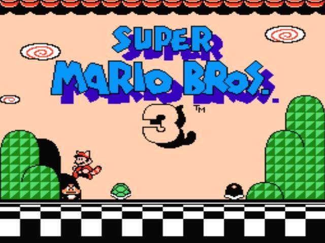

# Super Mario Bros. 3 Demo v2.0 (WIP)

## Installation
Only do this if the project isn't running.
+ Download VS2019 [here](https://visualstudio.microsoft.com/vs/)
+ Linker > Input > Additional Dependencies:\
`d3d10.lib;dxguid.lib;dinput8.lib;`
+ Tools > NuGet Package Manager > Package Manager Console and paste this in\
`Install-Package Microsoft.DXSDK.D3DX -Version 9.29.952.8`
+ SFML [here](https://www.sfml-dev.org/download.php) 
(Note: By the time I was writing this, the IDE version may have changed and the binaries may not be compatible with the project anymore, and if so, follow the instructions on SFML website.)
+ [***IMPORTANT***] Configuration: `Active(Debug)`, Platform: `Win32` or `x86`

## Controls
Only a few inputs supported, not mappable.
|Constraint |Key            |Action                  |
|-----------|---------------|------------------------|
|Global     |<kbd>Esc</kbd> |Exit application        |
|Intro only |<kbd>U</kbd>   |Select                  |
|           |<kbd>I</kbd>   |Start                   |
|Map only   |<kbd>W</kbd>   |Move up                 |
|           |<kbd>A</kbd>   |Move left               |
|           |<kbd>S</kbd>   |Move down               |
|           |<kbd>D</kbd>   |Move right              |
|           |<kbd>K</kbd>   |Select                  |
|Stage only |<kbd>W</kbd>   |Enter pipe              |
|           |<kbd>A</kbd>   |Move left               |
|           |<kbd>S</kbd>   |Crouch/Enter pipe       |
|           |<kbd>D</kbd>   |Move right              |
|           |<kbd>J</kbd>   |Throw/Attack/Hold shell |
|           |<kbd>K</kbd>   |Run/Fly/Jump/Float down |
|Debug only |<kbd>1</kbd>   |Set form to `SMALL`     |
|           |<kbd>2</kbd>   |Set form to `BIG`       |
|           |<kbd>3</kbd>   |Set form to `FIRE`      |
|           |<kbd>4</kbd>   |Set form to `RACCOON`   |

## Scenes available
+ Intro
+ Overworld map
+ Stage 1-1
+ S̯̭̝̯̜͉̮̭ͦ̔̋ͥ̀ę̥̩ͫ̃c̺̖͇̼͚̞̩̍ͦ̆̐͘r̛͍̗̙̰̞̻͒̾̊e͎͚͇̚͟t̤̰͎̲̙̩͛̎̕

## Credits
+ 125scratch, Jermungandr for the Mario & Luigi sprites.
+ Fleepa, Superjustinbros for the enemies sprites.
+ JigglyPuffGirl for the goal roulette sprites.
+ Malak for the world 1 map tileset.
+ DarkBowser100, Watcher for the HUD & font sprites.
+ Fleepa for misc. sprites.
+ rotodisco for the stage tileset.

## That's all
