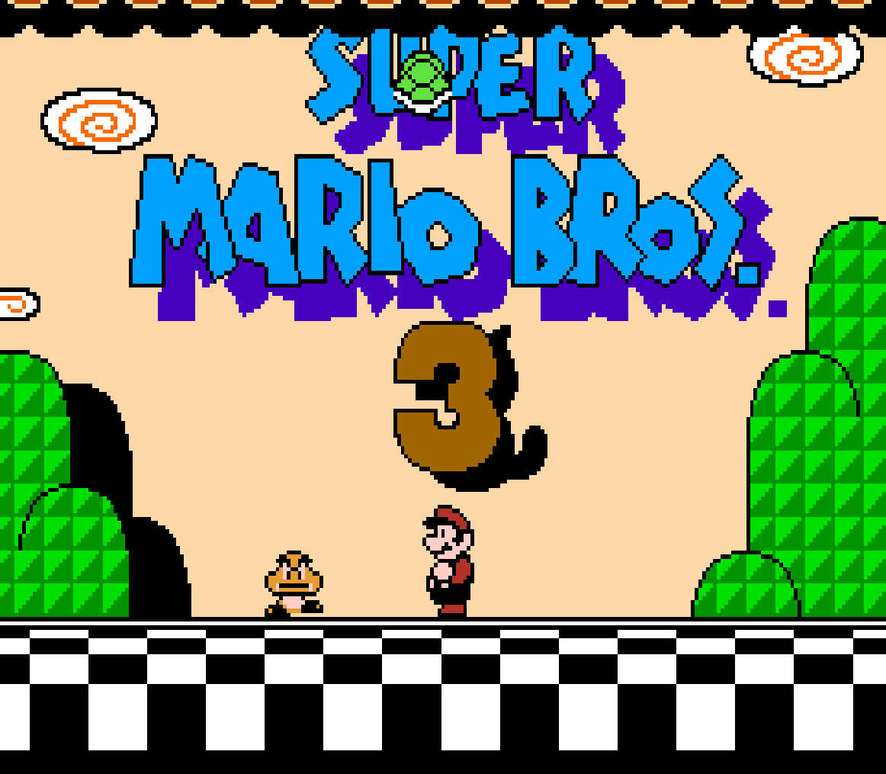
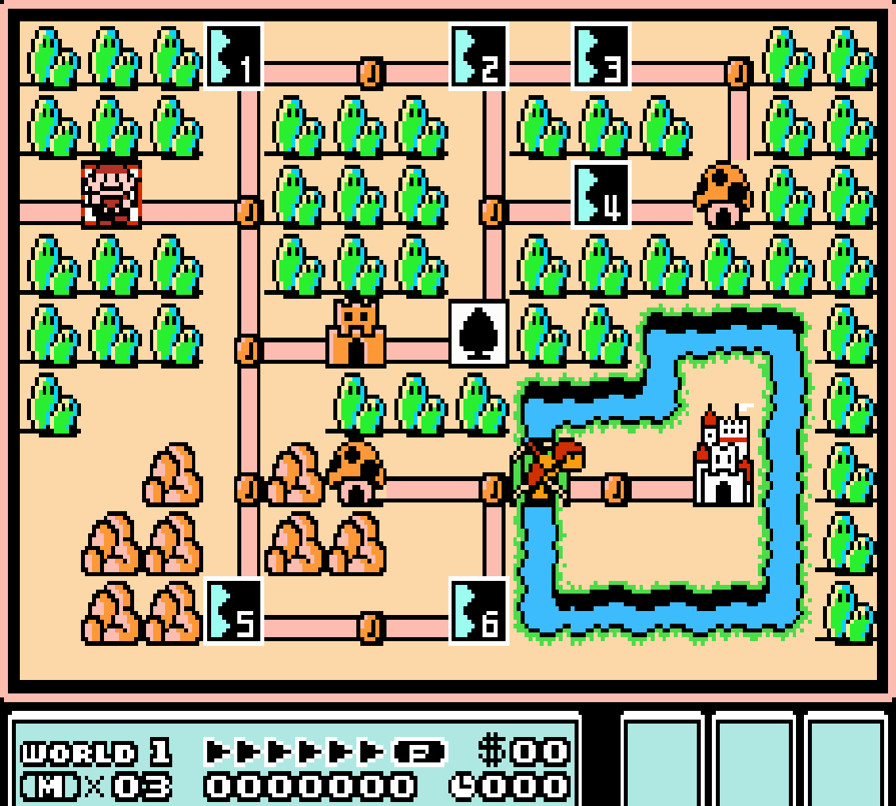
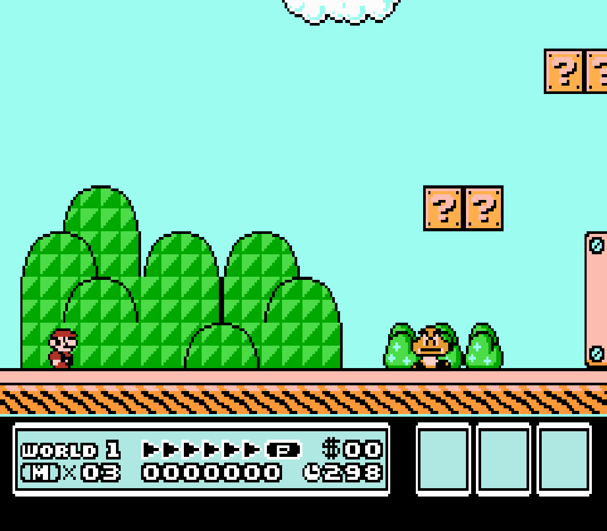
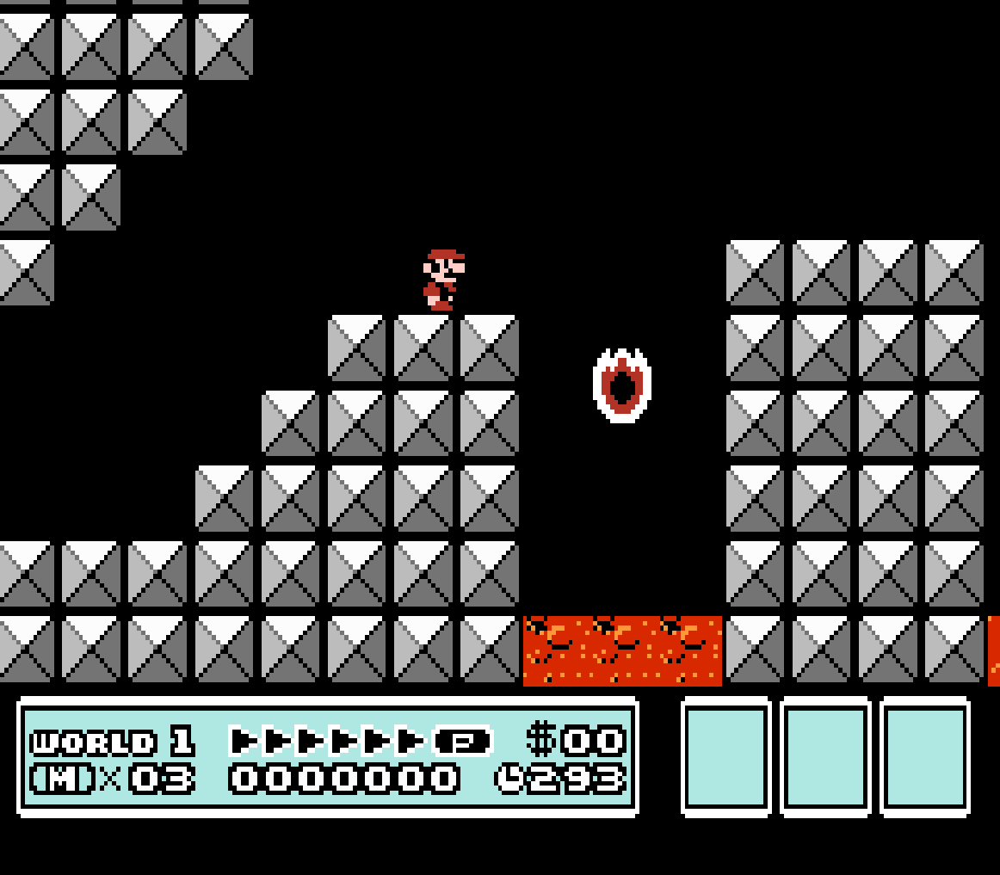

# Super Mario Bros. 3 Demo v2.0

## Requirements
+ OS: Windows® 10 32-bit+
+ Processor: Any modern processor
+ Memory: 512 MB+
+ Graphics: Intergrated graphics
+ DirectX: Version 10

## Installation
Only do this if the project isn't running.
+ Download VS2019 [here](https://visualstudio.microsoft.com/vs/)
+ Linker > Input > Additional Dependencies:\
`d3d10.lib;d3dcompiler.lib;dxguid.lib;dinput8.lib;`
+ Tools > NuGet Package Manager > Package Manager Console and paste this in\
`Install-Package Microsoft.DXSDK.D3DX -Version 9.29.952.8`
+ Download SFML [here](https://www.sfml-dev.org/download.php) and follow [the instructions](https://www.sfml-dev.org/tutorials/2.5/start-vc.php)
+ [***IMPORTANT***] Configuration: `Active(Debug)`, Platform: `Win32`

## Controls
For more information, see [KEYBINDS.md](KEYBINDS.md)
|Constraint |Key            |Action                  |
|-----------|---------------|------------------------|
|Global     |<kbd>Esc</kbd> |Exit application        |
|Intro      |<kbd>U</kbd>   |Select                  |
|           |<kbd>I</kbd>   |Start                   |
|Map        |<kbd>W</kbd>   |Move up                 |
|           |<kbd>A</kbd>   |Move left               |
|           |<kbd>S</kbd>   |Move down               |
|           |<kbd>D</kbd>   |Move right              |
|           |<kbd>K</kbd>   |Select                  |
|Stage      |<kbd>W</kbd>   |Enter pipe/door         |
|           |<kbd>A</kbd>   |Move left               |
|           |<kbd>S</kbd>   |Crouch/Enter pipe       |
|           |<kbd>D</kbd>   |Move right              |
|           |<kbd>J</kbd>   |Throw/Attack/Hold shell |
|           |<kbd>K</kbd>   |Run/Fly/Jump/Float down |
|Debug      |<kbd>Tab</kbd> |Toggle debug info       |
|           |<kbd>1</kbd>   |Set form to `SMALL`     |
|           |<kbd>2</kbd>   |Set form to `BIG`       |
|           |<kbd>3</kbd>   |Set form to `FIRE`      |
|           |<kbd>4</kbd>   |Set form to `RACCOON`   |

## Scenes available
+ Intro\

+ Overworld map\

+ Stage 1-1

+ Stage mini fortress

+ S̯̭̝̯̜͉̮̭ͦ̔̋ͥ̀ę̥̩ͫ̃c̺̖͇̼͚̞̩̍ͦ̆̐͘r̛͍̗̙̰̞̻͒̾̊e͎͚͇̚͟t̤̰͎̲̙̩͛̎̕

## Credits
+ [The Spriter Resources](https://www.spriters-resource.com/nes/supermariobros3/)
+ [The Sound Resources](https://www.sounds-resource.com/nes/smb3/)
+ [The Mushroom Kingdom](https://themushroomkingdom.net/media/smb3/wav)
+ [khinsider](https://downloads.khinsider.com/game-soundtracks/album/super-mario-bros.-3)
+ [nesmaps](https://nesmaps.com/maps/SuperMarioBrothers3/SuperMarioBrothers3.html)
+ [NovaWare (Kousaku-P)](https://youtu.be/2CxNhRCKiJA)
+ [SilvaGunner](https://youtu.be/rr9QBe5GLEk)

## That's all

